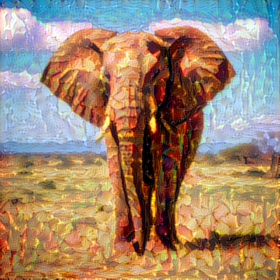

# 🎨 Neural Style Transfer with TensorFlow & Keras

This project implements **Neural Style Transfer (NST)** using a pretrained **VGG19** model in TensorFlow/Keras.  
NST blends the **content** of one image with the **style** of another, producing visually stunning artworks.  

---

## 🚀 Features
- Generate artistic images by combining content and style.  
- Configurable hyperparameters (content, style, and variation weights).  
- Pre-included examples (`cat`, `elephant`, `human`, `mountain`).  
- Available as both a Python script (`main.py`) and a Jupyter Notebook (`main.ipynb`).  

---

## 📦 Installation

```bash
# Clone the repository
git clone https://github.com/faisal-ajao/neural-style-transfer.git
cd neural-style-transfer

# Create a virtual environment (optional)
python -m venv venv
source venv/bin/activate   # Linux/Mac
venv\\Scripts\\activate      # Windows

# Install dependencies
pip install -r requirements.txt
```

---

## ▶️ Usage

Run the main script to generate a stylized image:

```bash
python main.py
```

Or experiment interactively with the Jupyter notebook:

```bash
jupyter notebook main.ipynb
```

---

## 📊 Output Example (Image)  

Example with **elephant.jpg** (content) + **forest.jpg** (style):  

<p>
  
</p>

---

## 📂 Project Structure
```
neural-style-transfer/
├── README.md
├── assets/                     # Generated example results
│   ├── cat_picasso_at_epoch_4000.png
│   ├── elephant_forest_at_epoch_4000.png
│   ├── human_starry_night_at_epoch_4000.png
│   └── mountain_wave_at_epoch_4000.png
├── content_images/              # Input content images
│   ├── cat.jpg
│   ├── elephant.jpg
│   ├── human.jpg
│   └── mountain.jpg
├── style_images/                # Input style images
│   ├── forest.jpg
│   ├── picasso.jpg
│   ├── starry_night.jpg
│   └── wave.jpg
├── output_images/               # Auto-saved generated results
│   └── .gitkeep
├── main.ipynb                   # Notebook version
├── main.py                      # Script version
└── requirements.txt
```

---

## 🧠 Tech Stack
- Python 3.10  
- TensorFlow / Keras  
- NumPy  

---

## 📜 License
This project is licensed under the MIT License – see the [LICENSE](LICENSE) file for details.
